# Numeric Distribution Analysis

Fields analyzed: ClosePrice, ListPrice, OriginalListPrice, LivingArea, LotSizeAcres, BedroomsTotal, BathroomsTotalInteger, DaysOnMarket, YearBuilt.

## Listed_Final

### ClosePrice

- Source column: `close_price`
- Non-missing: 143,605
- Missing: 396,812
- Mean: 1201635.49
- Median: 852000.00
- Percentiles: 1th=215000.00, 5th=354500.00, 25th=600000.00, 50th=852000.00, 75th=1350000.00, 95th=2900000.00, 99th=5500000.00
- Outliers (IQR rule): 10,308 (low<-525000.00, high>2475000.00)
- Outlier range: 2475650.00 to 820000000.00

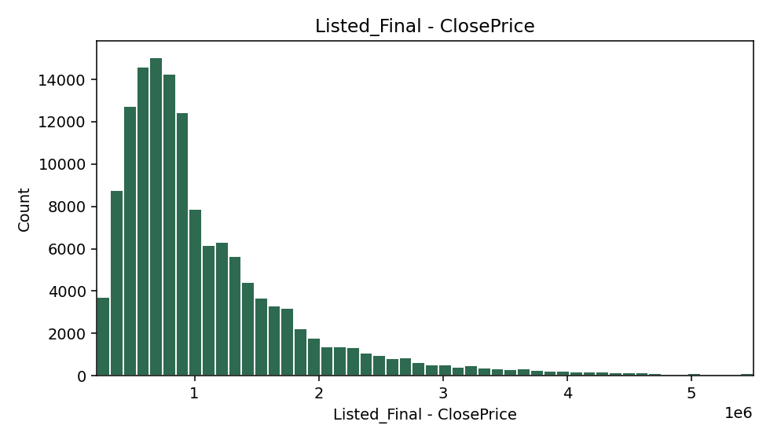

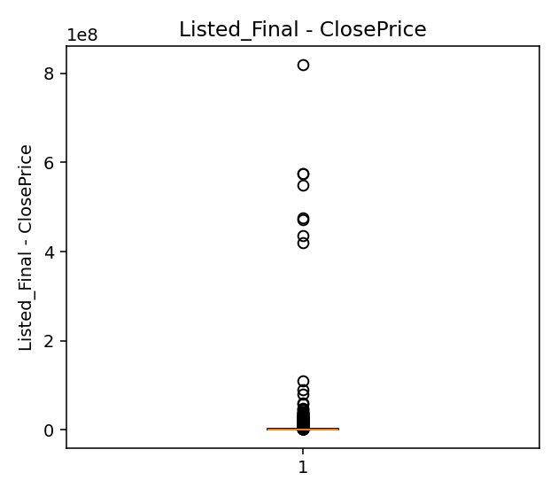

### ListPrice

- Source column: `list_price`
- Non-missing: 540,417
- Missing: 0
- Mean: 1313797.11
- Median: 844900.00
- Percentiles: 1th=210000.00, 5th=345000.00, 25th=580000.00, 50th=844900.00, 75th=1375000.00, 95th=3450000.00, 99th=8200000.00
- Outliers (IQR rule): 45,571 (low<-612500.00, high>2567500.00)
- Outlier range: 2568000.00 to 195000000.00

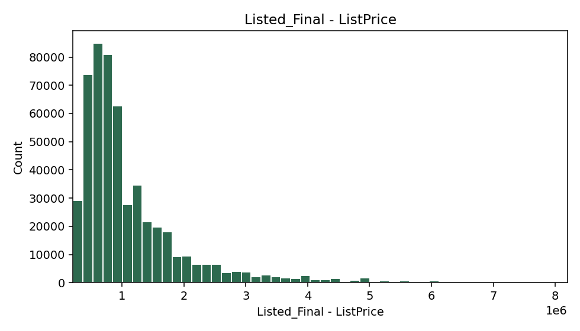

### OriginalListPrice

- Source column: `original_list_price`
- Non-missing: 539,647
- Missing: 770
- Mean: 1397750.57
- Median: 849000.00
- Percentiles: 1th=200000.00, 5th=346000.00, 25th=585000.00, 50th=849000.00, 75th=1389000.00, 95th=3495000.00, 99th=8500000.00
- Outliers (IQR rule): 45,414 (low<-621000.00, high>2595000.00)
- Outlier range: 2595555.00 to 1390000000.00

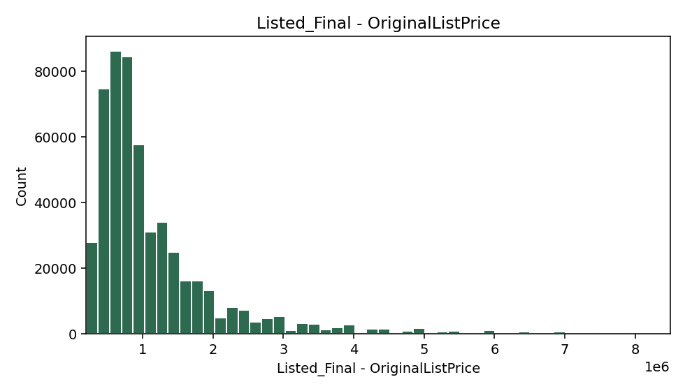

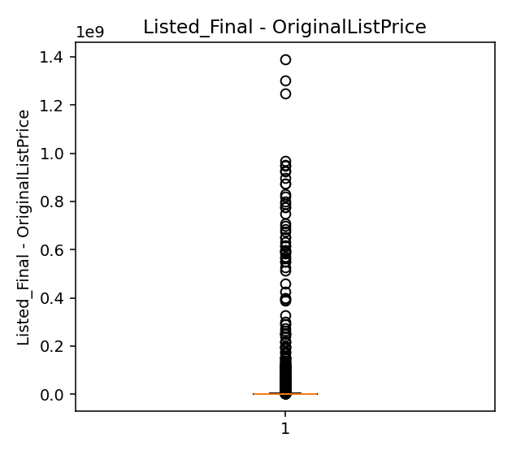

### LivingArea

- Source column: `living_area`
- Non-missing: 539,865
- Missing: 552
- Mean: 1980.07
- Median: 1669.00
- Percentiles: 1th=588.00, 5th=816.00, 25th=1247.00, 50th=1669.00, 75th=2300.00, 95th=3868.00, 99th=6300.00
- Outliers (IQR rule): 26,737 (low<-332.50, high>3879.50)
- Outlier range: 3880.00 to 17021321.00

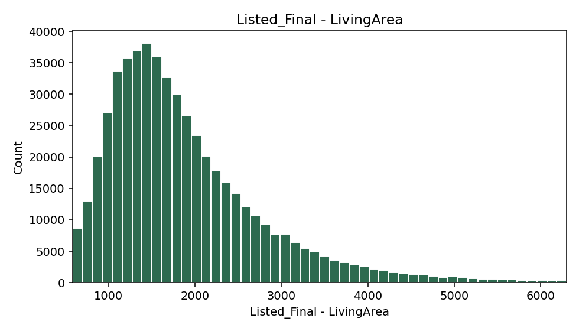

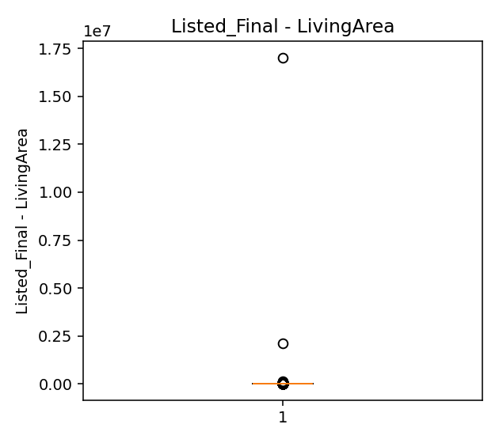

### LotSizeAcres

- Source column: `lot_size_acres`
- Non-missing: 495,859
- Missing: 44,558
- Mean: 65.21
- Median: 0.17
- Percentiles: 1th=0.00, 5th=0.03, 25th=0.12, 50th=0.17, 75th=0.31, 95th=3.57, 99th=13.52
- Outliers (IQR rule): 79,468 (low<-0.17, high>0.60)
- Outlier range: 0.60 to 4187292.00

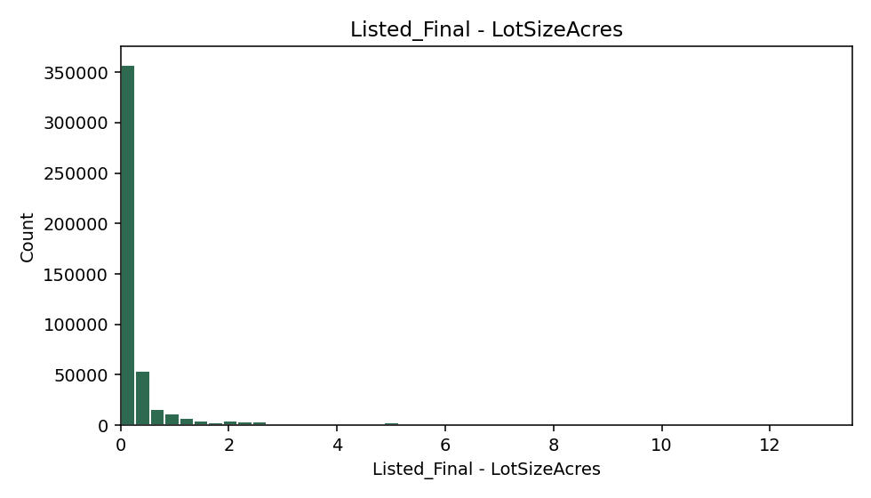

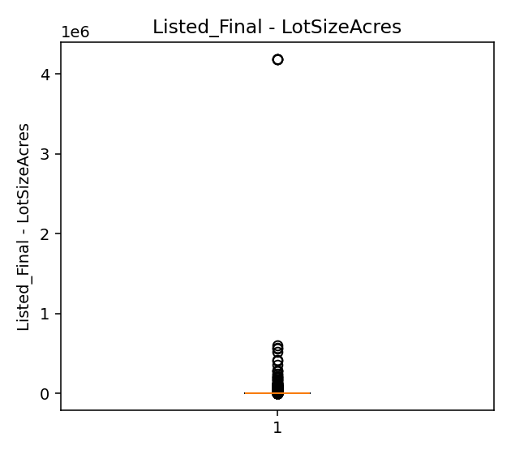

### BedroomsTotal

- Source column: `bedrooms_total`
- Non-missing: 540,270
- Missing: 147
- Mean: 3.22
- Median: 3.00
- Percentiles: 1th=1.00, 5th=2.00, 25th=2.00, 50th=3.00, 75th=4.00, 95th=5.00, 99th=6.00
- Outliers (IQR rule): 1,735 (low<-1.00, high>7.00)
- Outlier range: 8.00 to 94.00

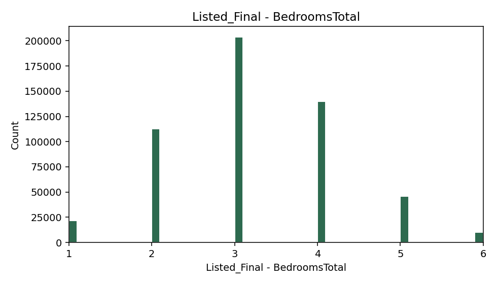

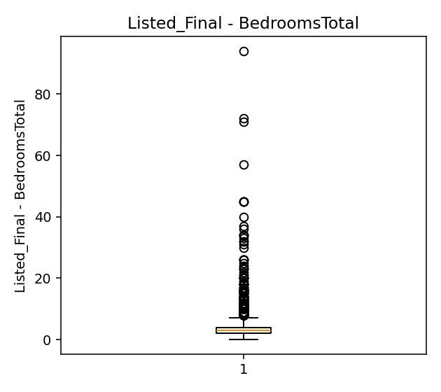

### BathroomsTotalInteger

- Source column: `bathrooms_total_integer`
- Non-missing: 540,362
- Missing: 55
- Mean: 2.63
- Median: 2.00
- Percentiles: 1th=1.00, 5th=1.00, 25th=2.00, 50th=2.00, 75th=3.00, 95th=5.00, 99th=7.00
- Outliers (IQR rule): 34,261 (low<0.50, high>4.50)
- Outlier range: 0.00 to 2208.00

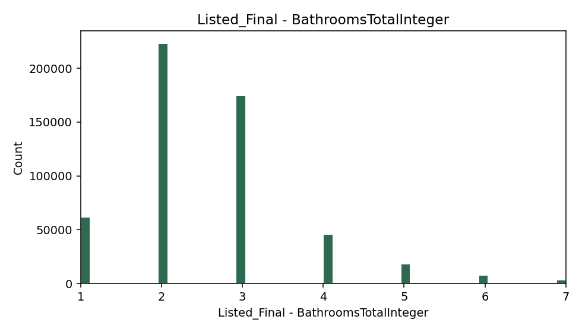

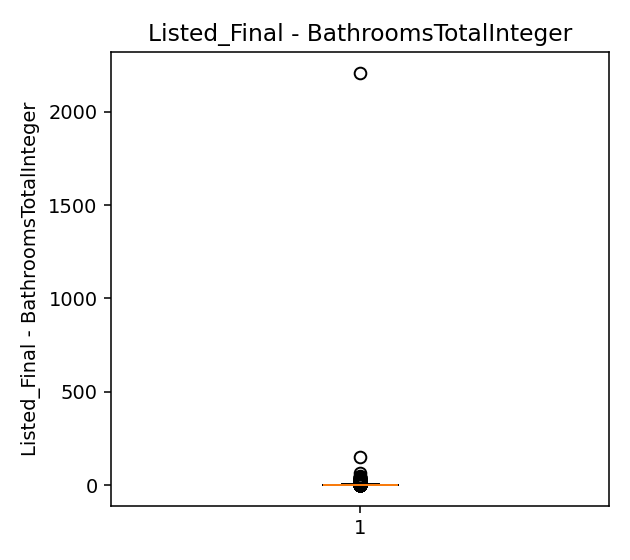

### DaysOnMarket

- Source column: `days_on_market`
- Non-missing: 540,417
- Missing: 0
- Mean: 19.34
- Median: 11.00
- Percentiles: 1th=0.00, 5th=0.00, 25th=5.00, 50th=11.00, 75th=22.00, 95th=71.00, 99th=139.00
- Outliers (IQR rule): 48,186 (low<-20.50, high>47.50)
- Outlier range: -58.00 to 731.00

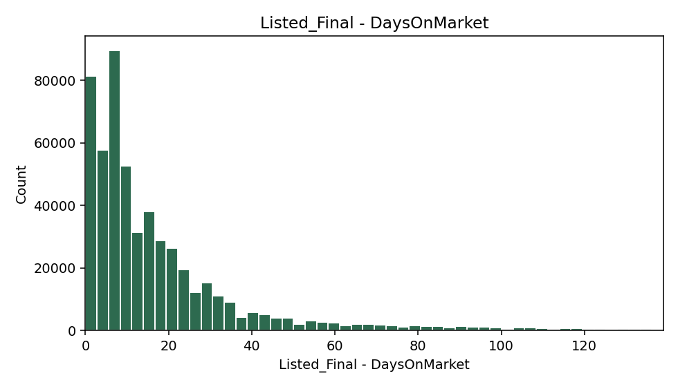

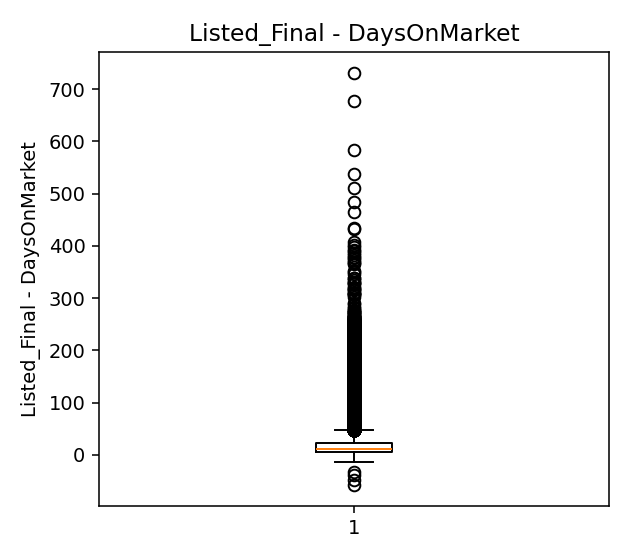

### YearBuilt

- Source column: `year_built`
- Non-missing: 539,483
- Missing: 934
- Mean: 1979.60
- Median: 1980.00
- Percentiles: 1th=1911.00, 5th=1929.00, 25th=1961.00, 50th=1980.00, 75th=2001.00, 95th=2023.00, 99th=2025.00
- Outliers (IQR rule): 1,363 (low<1901.00, high>2061.00)
- Outlier range: 1776.00 to 1900.00

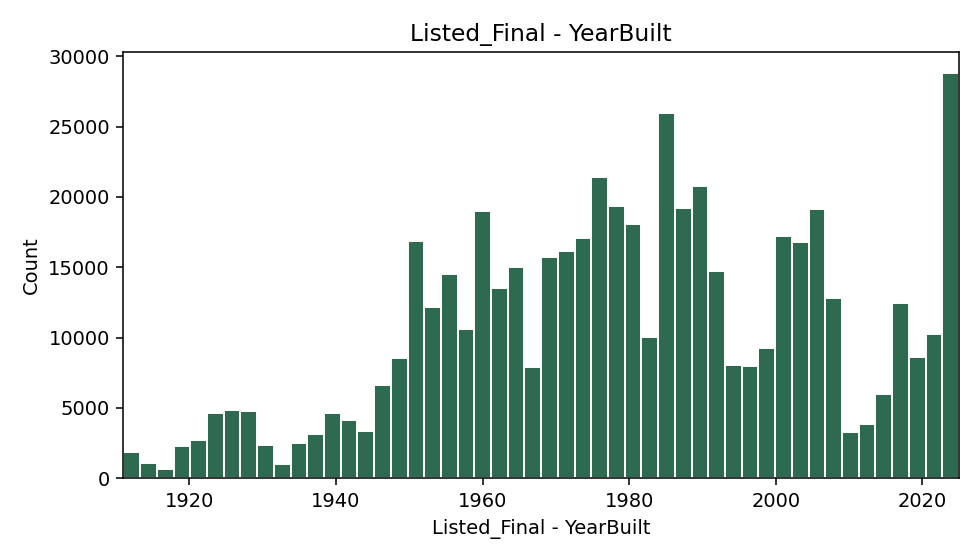

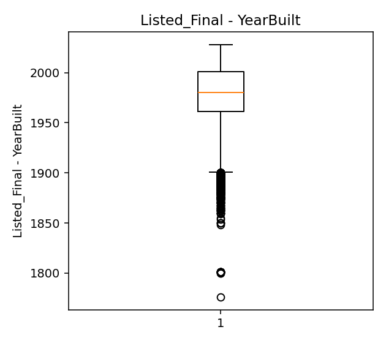

## Sold_Final

### ClosePrice

- Source column: `close_price`
- Non-missing: 397,305
- Missing: 2
- Mean: 1186328.12
- Median: 820000.00
- Percentiles: 1th=202208.00, 5th=340000.00, 25th=575000.00, 50th=820000.00, 75th=1300000.00, 95th=2850000.00, 99th=5550000.00
- Outliers (IQR rule): 29,389 (low<-512500.00, high>2387500.00)
- Outlier range: 2388000.00 to 989500000.00

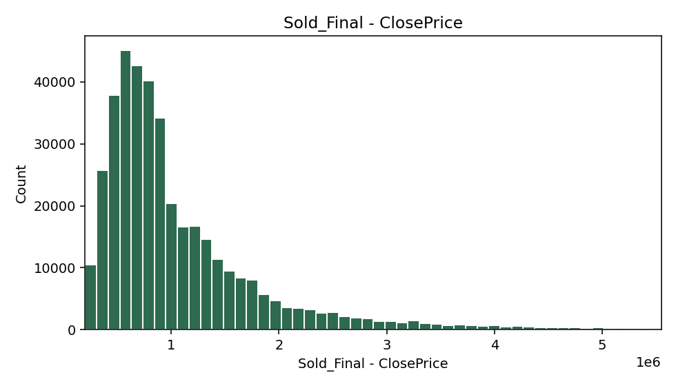

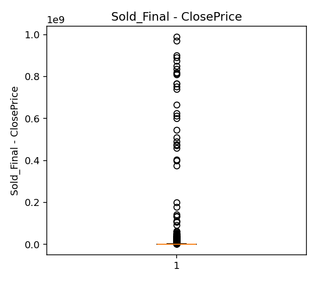

### ListPrice

- Source column: `list_price`
- Non-missing: 397,307
- Missing: 0
- Mean: 1138635.16
- Median: 815000.00
- Percentiles: 1th=214900.00, 5th=346000.00, 25th=575000.50, 50th=815000.00, 75th=1295000.00, 95th=2850000.00, 99th=5695000.00
- Outliers (IQR rule): 29,671 (low<-504998.75, high>2374999.25)
- Outlier range: 2375000.00 to 137500000.00

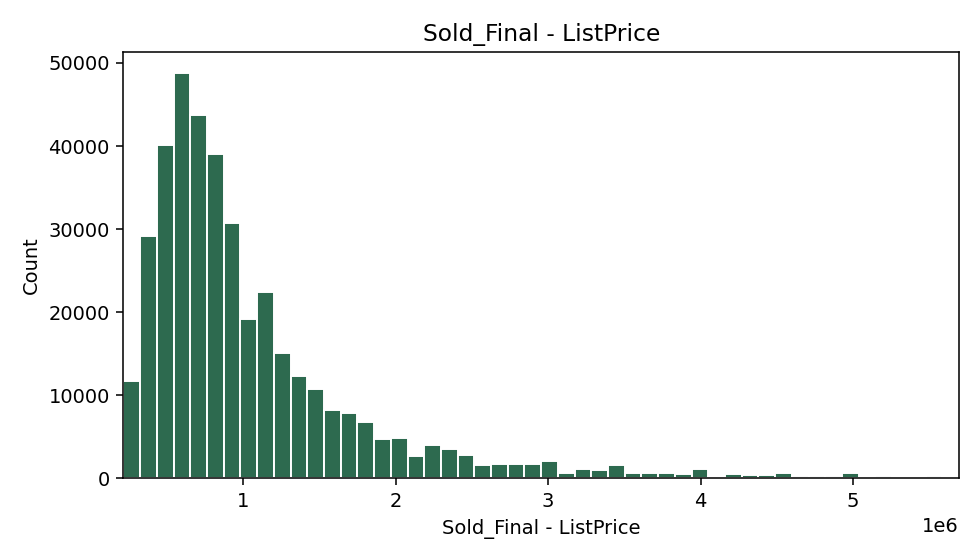

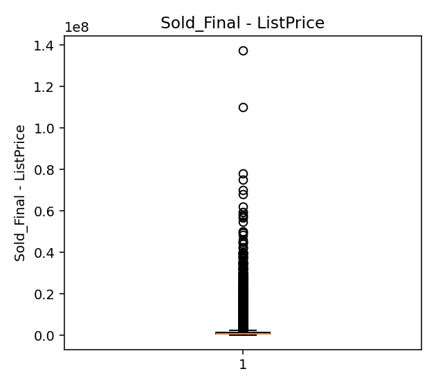

### OriginalListPrice

- Source column: `original_list_price`
- Non-missing: 396,591
- Missing: 716
- Mean: 1224820.77
- Median: 825000.00
- Percentiles: 1th=210000.00, 5th=349900.00, 25th=585000.00, 50th=825000.00, 75th=1299000.00, 95th=2899000.00, 99th=5995000.00
- Outliers (IQR rule): 30,843 (low<-486000.00, high>2370000.00)
- Outlier range: 2374500.00 to 1390000000.00

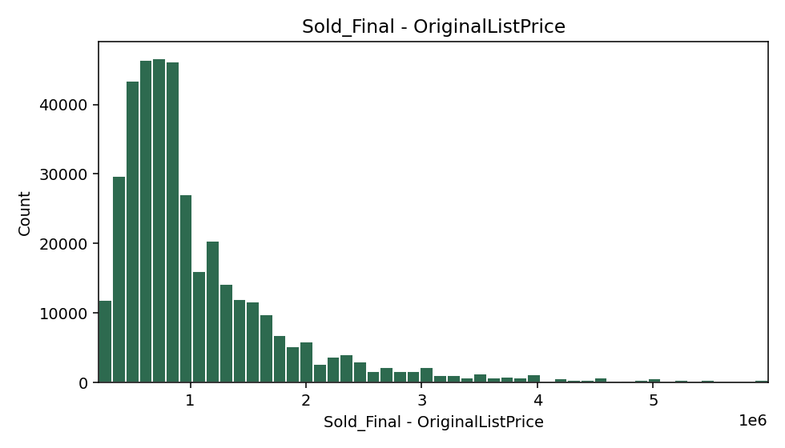

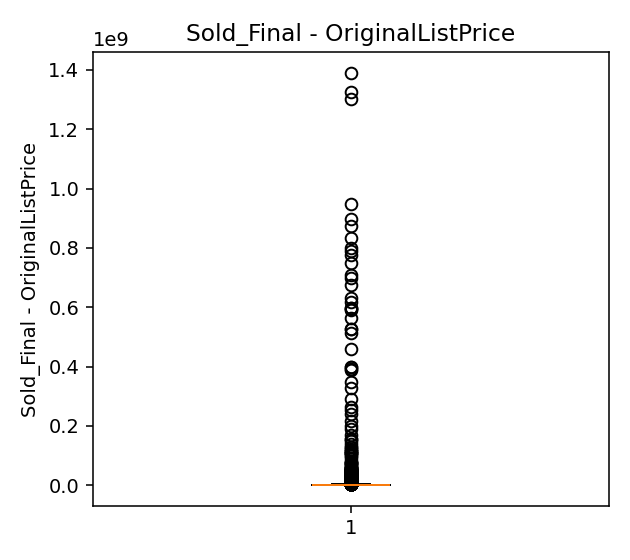

### LivingArea

- Source column: `living_area`
- Non-missing: 397,079
- Missing: 228
- Mean: 1904.38
- Median: 1641.00
- Percentiles: 1th=604.00, 5th=839.00, 25th=1247.00, 50th=1641.00, 75th=2217.00, 95th=3558.00, 99th=5280.00
- Outliers (IQR rule): 17,528 (low<-208.00, high>3672.00)
- Outlier range: 3673.00 to 17021321.00

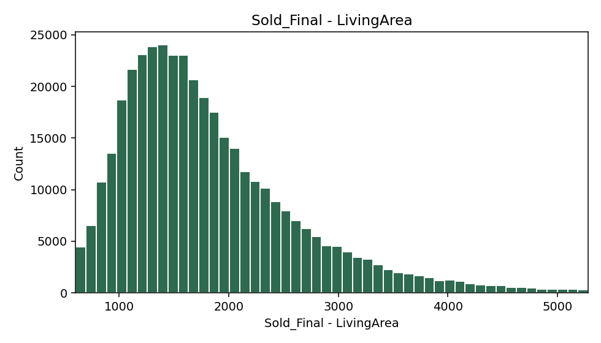

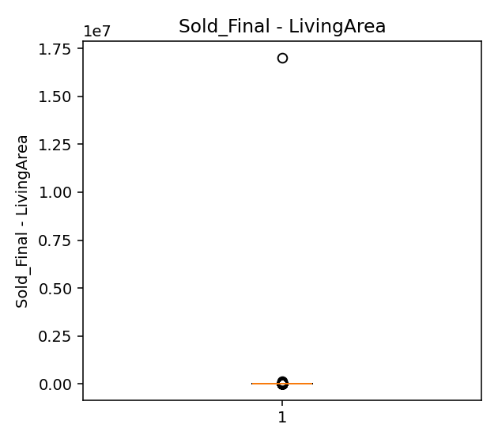

### LotSizeAcres

- Source column: `lot_size_acres`
- Non-missing: 365,986
- Missing: 31,321
- Mean: 68.37
- Median: 0.17
- Percentiles: 1th=0.00, 5th=0.03, 25th=0.12, 50th=0.17, 75th=0.27, 95th=2.81, 99th=10.80
- Outliers (IQR rule): 56,935 (low<-0.11, high>0.50)
- Outlier range: 0.50 to 7810698.36

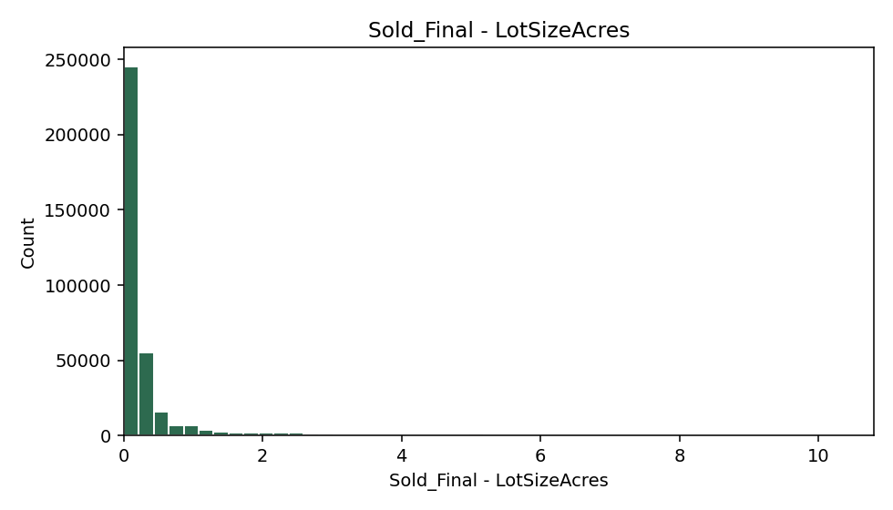

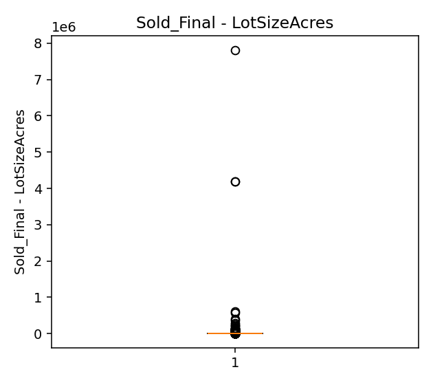

### BedroomsTotal

- Source column: `bedrooms_total`
- Non-missing: 397,296
- Missing: 11
- Mean: 3.20
- Median: 3.00
- Percentiles: 1th=1.00, 5th=2.00, 25th=3.00, 50th=3.00, 75th=4.00, 95th=5.00, 99th=6.00
- Outliers (IQR rule): 21,896 (low<1.50, high>5.50)
- Outlier range: 0.00 to 45.00

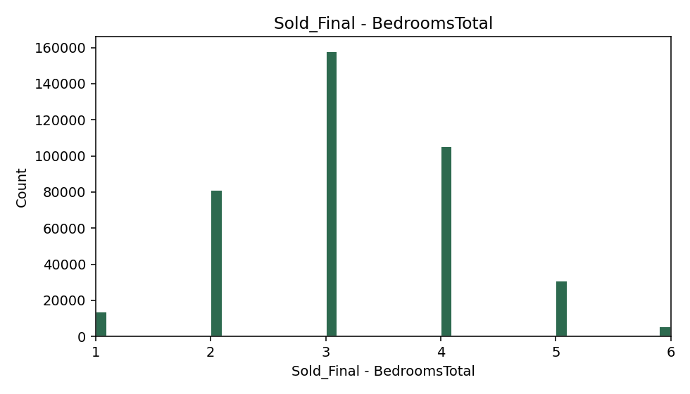

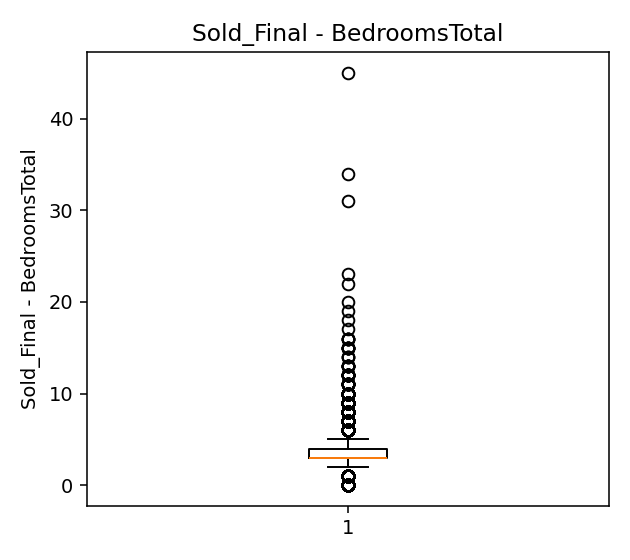

### BathroomsTotalInteger

- Source column: `bathrooms_total_integer`
- Non-missing: 397,238
- Missing: 69
- Mean: 2.53
- Median: 2.00
- Percentiles: 1th=1.00, 5th=1.00, 25th=2.00, 50th=2.00, 75th=3.00, 95th=4.00, 99th=6.00
- Outliers (IQR rule): 18,226 (low<0.50, high>4.50)
- Outlier range: 0.00 to 175.00

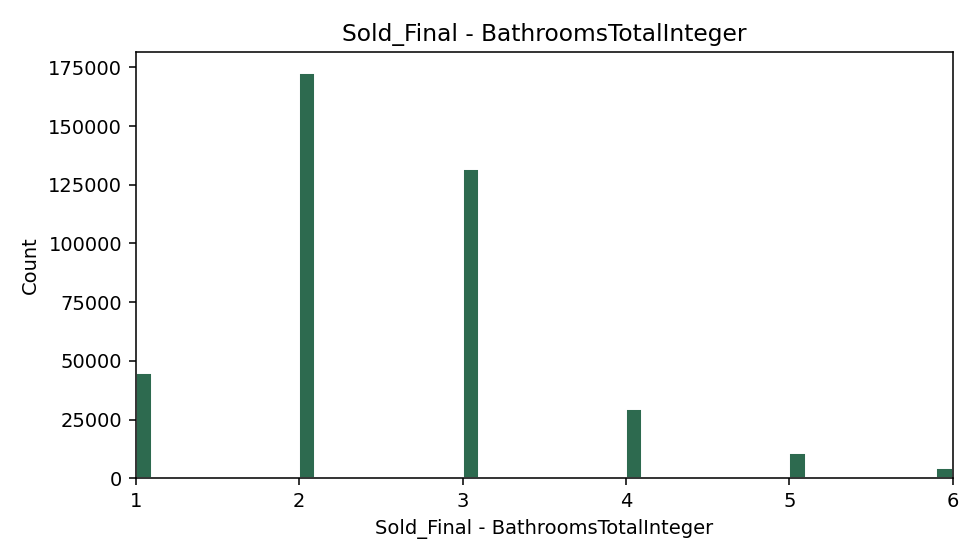

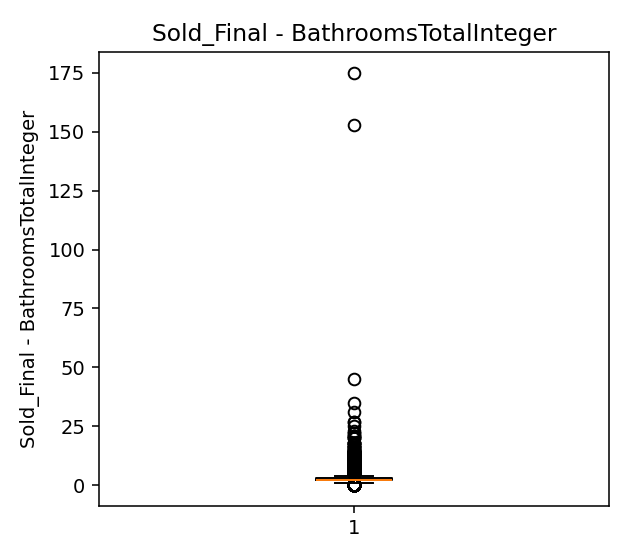

### DaysOnMarket

- Source column: `days_on_market`
- Non-missing: 397,307
- Missing: 0
- Mean: 37.32
- Median: 19.00
- Percentiles: 1th=0.00, 5th=1.00, 25th=8.00, 50th=19.00, 75th=48.00, 95th=131.00, 99th=229.00
- Outliers (IQR rule): 30,224 (low<-52.00, high>108.00)
- Outlier range: -288.00 to 12430.00

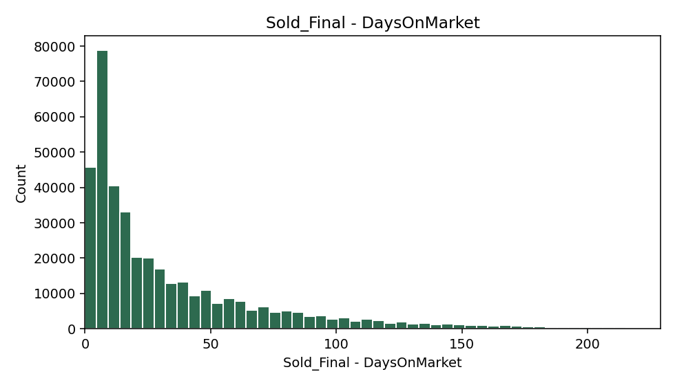

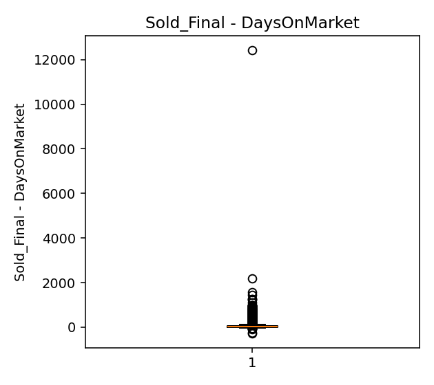

### YearBuilt

- Source column: `year_built`
- Non-missing: 396,951
- Missing: 356
- Mean: 1978.56
- Median: 1979.00
- Percentiles: 1th=1912.00, 5th=1930.00, 25th=1960.00, 50th=1979.00, 75th=1999.00, 95th=2022.00, 99th=2025.00
- Outliers (IQR rule): 941 (low<1901.50, high>2057.50)
- Outlier range: 1776.00 to 1901.00

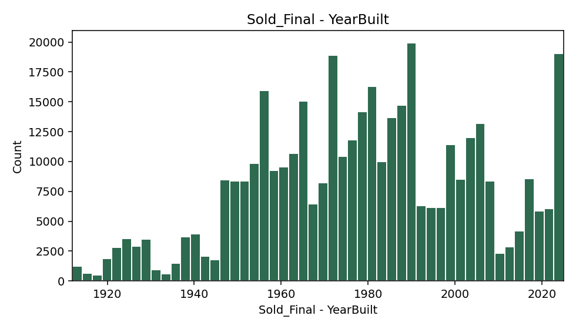

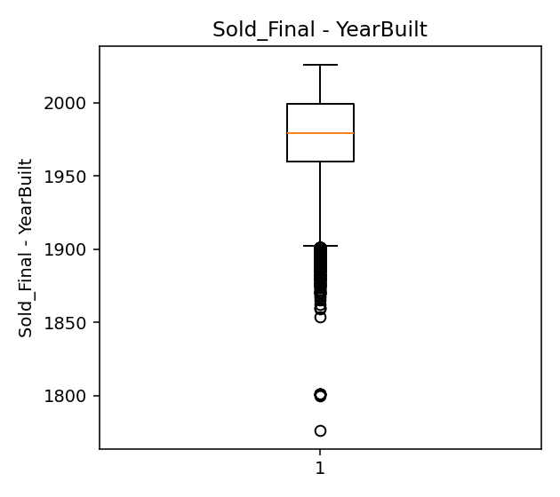

